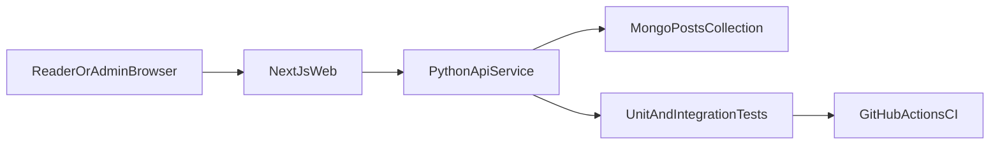

# Playground Blog Build Order

## Recommended First Build
Start with a **vertical slice MVP**: one small but complete feature from UI to DB to CI.  
Given your choice (fast MVP + no frontend preference), use:
- Frontend: **Next.js** (best breadth: UI + API routes + SSR/CSR patterns)
- Backend in this repo: keep your existing Python modules and expose a small API service for learning backend best practices
- Data: MongoDB (already present via [docker-compose.yaml](/Users/giannis/Github/digital-vault/docker-compose.yaml))

This gives the fastest learning loop: build feature -> test -> containerize -> CI -> document as course material.

## Current Repo Baseline (What to Reuse)
- Python project + tooling in [pyproject.toml](/Users/giannis/Github/digital-vault/pyproject.toml), [uv.lock](/Users/giannis/Github/digital-vault/uv.lock)
- Mongo/local workflow in [Makefile](/Users/giannis/Github/digital-vault/Makefile)
- Existing infra patterns in [src/configurations](/Users/giannis/Github/digital-vault/src/configurations)
- Existing logging experimentation in [src/shared_utils/logging/handlers.py](/Users/giannis/Github/digital-vault/src/shared_utils/logging/handlers.py) and test style in [tests/test_mongo_handler.py](/Users/giannis/Github/digital-vault/tests/test_mongo_handler.py)

## Milestone Sequence (Build Order)

### 1) MVP Vertical Slice (Build this first)
Goal: publish and read blog posts with minimal auth.
- Create frontend app (`apps/web`) with pages:
  - Home (list posts)
  - Post detail
  - Admin draft/publish form (simple password gate initially)
- Create backend API (`apps/api` or `src/api`) endpoints:
  - `GET /posts`
  - `GET /posts/{slug}`
  - `POST /posts`
  - `PATCH /posts/{id}`
- Define one Mongo collection (`posts`) with fields: title, slug, content_md, tags, status, created_at, updated_at
- Add unit tests for post validation + integration test for create/read path

### 2) Developer Workflow Foundation
Goal: keep learning velocity high.
- Add unified commands to [Makefile](/Users/giannis/Github/digital-vault/Makefile): run web, run api, test-all, lint-all, typecheck-all
- Add pre-commit hooks (format/lint/typecheck on changed files)
- Add `.env.example` and environment loading docs

### 3) CI/CD and Quality Gates
Goal: make every change reviewable and safe.
- Add GitHub Actions workflow for:
  - Python checks/tests
  - Frontend lint/build/test
  - Optional Mongo service container for integration tests
- Enable PR template with checklist (tests, docs, screenshots)
- Introduce coverage threshold only after baseline tests are stable

### 4) Blog-as-Course Features
Goal: transform project into learning material.
- Add `learning_notes` metadata to each post:
  - topic, difficulty, prerequisites, references
- Add “What I learned” section in frontend template
- Add generated index page grouped by topic/timeline

### 5) Production-Oriented Patterns (Incremental)
Goal: practice engineering best practices safely.
- Auth upgrade: from simple admin password to real user auth (session/JWT)
- Observability: structured logs + request IDs + basic metrics
- Caching/search: add post search and cache popular reads
- Release discipline: semantic version tags + changelog automation

## Suggested Folder Shape
- `apps/web` -> Next.js UI
- `apps/api` (or `src/api`) -> Python API and domain logic
- `packages/contracts` (optional later) -> shared schemas/types
- `docs/` -> architecture notes + learning journal entries

## Learning Loop Per Feature
For each feature, follow:
1. Define success criteria (1 paragraph)
2. Implement smallest vertical slice
3. Add tests (unit + one integration)
4. Add docs note (`what/why/tradeoff`)
5. Add CI check

## Architecture Flow (MVP)

## Why This Order Works
- You ship value immediately (real blog behavior in week 1)
- Every later milestone extends a working system instead of isolated experiments
- You can turn each merged PR into a mini-lesson for your course material